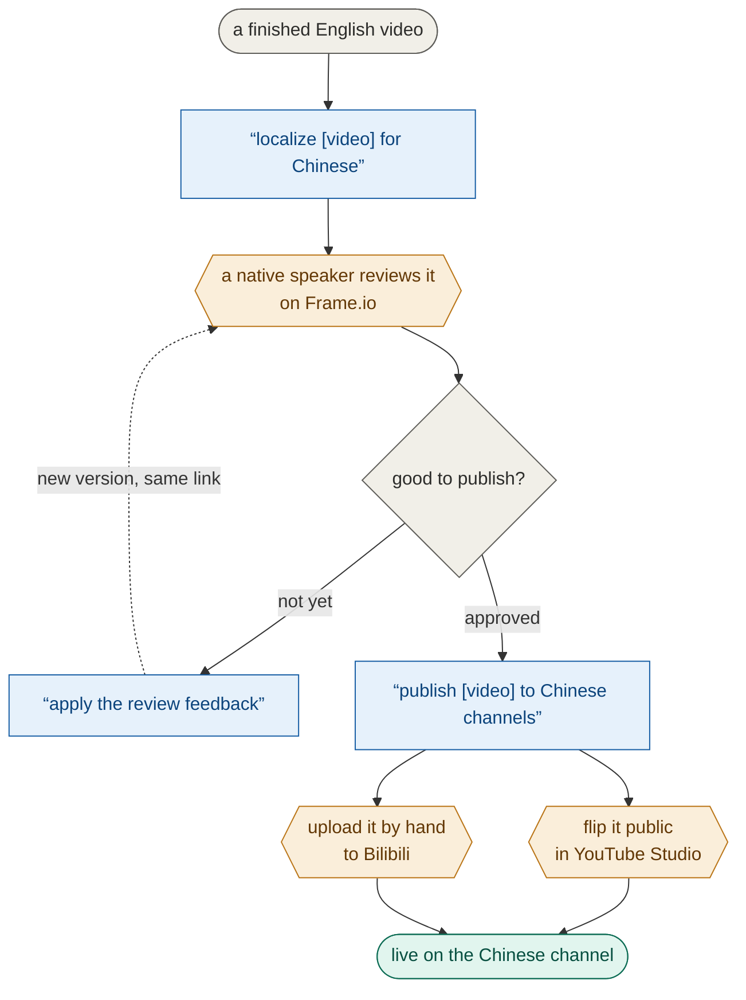

# cn-dub-pipeline

Turns a finished Gravgear/Yellow Dude YouTube video into a Chinese-dubbed
version — translated, voiced, subtitled, rendered, sent for native-speaker
review, and published — with Claude doing the machine work and humans making
the judgment calls.

**If you just want to use it, read the first half of this page and stop.**
The machine internals live in the second half and in `docs/`.

---

## Part 1 · The human guide

### How a video gets localized



> 🟦 what you type to Claude   ·   🟧 you do it by hand   ·   everything else runs automatically

You talk to Claude in plain language. There are only three phrases to know:

1. **"localize {project-id} for Chinese"** — Claude transcribes the English,
   writes a natural Chinese script, generates the voiceover, adds subtitles,
   renders the video, uploads it to Frame.io for review, and files the review
   link into the Notion Chinese database. Takes roughly an hour; you can walk
   away.
2. **"apply the review feedback for {project-id}"** — after the native
   reviewer has watched the cut on Frame.io and left time-coded comments
   (Notion page comments work too), Claude reads every comment, makes the
   fixes, and puts a new version on the **same** review link so the reviewer
   can compare old vs new with one dropdown.
3. **"publish {project-id} to Chinese channels"** — once the reviewer says
   it's good, Claude uploads the video to the Chinese YouTube channel as a
   **private draft**, sets the thumbnail, and files the link back into
   Notion. Nothing goes live by itself.

### What only humans do

- **Review the video.** A native speaker watches the Frame.io link and leaves
  comments at the exact moments something feels off. This is the quality
  gate — the pipeline never skips it.
- **Approve publishing.** A "good to publish" comment from the reviewer is
  what unlocks step 3 above.
- **Flip the video public.** Claude uploads drafts only. A human presses the
  actual publish button in YouTube Studio.
- **Bilibili uploads** are still manual (waiting on API access) — see
  `docs/cn_staff_handoff.html` for that checklist.
- **Hold the keys.** The two paid API keys come from Wayne via password
  manager — never Slack or email.

That's the whole job. Everything else — timing, syncing the voice to the
picture, subtitle sizing, not double-publishing, not overspending on the paid
voice API — is enforced by the machinery, not by you remembering things.

---

## Part 2 · Setup (once per machine)

You don't follow a checklist — you hand the job to Claude. In the Claude
desktop app (signed into the Gravgear team), start a chat and paste this:

> Set up cn-dub-pipeline on my Mac from https://github.com/yelllowdude/cn-dub-pipeline —
> follow the setup steps in its README: install the tools it needs, register
> and enable the plugin, run `cn-pipeline-setup`, fill in my Google Drive
> path, then run the validation dry-run. Stop and ask me whenever there's
> something only I can do.

Approve the commands as they scroll by. Claude does all the mechanical work
and pauses at the **only three things it can't do for you**:

1. **Paste the API keys** — ElevenLabs + KIE, from Wayne via password manager.
   You type them yourself; Claude never handles your secrets.
2. **Sign into Google Drive for desktop** (with the `General` shared drive) —
   a one-time login.
3. **Restart the app once** — a freshly-registered plugin only loads on
   restart, and Claude can't restart the app it's running in.

That's the whole thing: one prompt, plus those three. When it's done, ask
"what skills are available?" — `localize-chinese` means you're ready.

<details>
<summary><b>The exact steps</b> — what Claude follows, and how to do it by hand</summary>

Prerequisites: macOS; the Claude desktop app (or Claude Code CLI) signed into
the Gravgear team; Google Drive for desktop signed in.

1. **Install the tools:** `brew install ffmpeg-full python@3.14` (install
   Homebrew first if needed: https://brew.sh). It must be `ffmpeg-full`, not
   plain `ffmpeg` — only that formula has libass (subtitle burn-in) and the
   videotoolbox hardware encoder.
2. **Register + enable the plugin** by merging into `~/.claude/settings.json`
   (don't overwrite other settings):
   - `extraKnownMarketplaces`: `{"gravgear-tools": {"source": {"source": "github", "repo": "yelllowdude/cn-dub-pipeline"}}}`
   - `enabledPlugins`: `{"cn-dub-pipeline@gravgear-tools": true}`

   Terminal alternative (Claude Code CLI): `/plugin marketplace add yelllowdude/cn-dub-pipeline`
   then `/plugin install cn-dub-pipeline@gravgear-tools`.
3. **Restart the Claude app** so the plugin loads. *(human)*
4. **Run `cn-pipeline-setup`** — creates the Python venv plus starter `.env`
   and `config.json` under `~/.claude/plugins/data/…` (outside the synced
   plugin files, so a plugin update never wipes them). It prints the exact
   path.
5. **Fill in the two files:** the API keys in `.env` *(human — secrets)*;
   `drive_root` in `config.json` = `/Users/<your-mac-username>/Library/CloudStorage/GoogleDrive-wayne@thegravgear.com/Shared drives/General`
   (differs from anyone else's only by the username — Claude can fill this in).
6. **Confirm:** ask "what skills are available?" — `localize-chinese` should
   be listed.
7. **Validate before the first real run:** dry-run against a project that's
   already been localized (ask Wayne for the known-good baseline) and check
   the output durations match the published files in its Drive `/CN/` folder.
   `docs/VALIDATE.md` is the copy-paste runbook.

</details>

---

## Part 3 · The machine part

Everything below is reference for people working on the pipeline itself.
`docs/cn_workflow.html` is the source of truth for stage rules, thresholds
and exceptions; `CLAUDE.md` covers the working conventions for changing this
code.

### What actually happens during "localize"

The pipeline's default is **native dub mode** (dub-first): instead of forcing
Chinese speech into the English cue timing (which sounds rushed), the Chinese
is written as natural spoken passages, voiced at natural pace, and synced to
the picture through **beats** — each 1–2 sentences pinned to the English
segment whose meaning they carry, because the animation was timed to the
English narration. Subtitles are then derived *from* the finished dub, so cue
breaks land at natural Chinese sentence boundaries.

Stage by stage:

1. **Transcribe** — Whisper transcription of the English master → cue-level
   segments (`align extract-audio` / `transcribe`, `subtitles split-cues`).
2. **Anchors** — scene cuts + speech gaps propose visual sync points
   automatically; the operator reviews them (`anchors detect` / `validate`).
3. **Native script** — the operator (Claude, live judgment) writes
   beat-tagged natural Chinese, glossary-checked (`glossary/cn_glossary.md`
   is law: product names stay English). Ingested via
   `subtitles ingest-script`.
4. **Dub** — one ElevenLabs take per passage at natural pace
   (`dub generate`). A passage that doesn't fit its window is fixed by
   **tightening the wording, never by speeding up speech** (atempo hard cap
   1.06). `dub finalize` cuts takes at inter-sentence silences and places
   each beat on its visual timestamp; `dub tighten` + `dub mix-me` add the
   Demucs-separated M&E bed.
5. **Subtitles from the dub** — `subtitles split-zh-cues` (hard 20-char cap)
   + `align align-dub` (forced alignment to the actual speech).
6. **Render + gates** — `render cndub`, then two close-out gates:
   `dub verify-anchors` (every beat's speech onset measured from the real
   audio, ±500ms) and `render verify` (duration).
7. **Review loop** — `review submit` uploads to Frame.io as a version stack
   (stable share link across re-cuts); `review fetch` / `apply` pull
   time-coded comments back and apply the mechanical fixes.
8. **Publish** — `publish youtube` uploads the highest `_vN` as a private
   draft + sets the CN thumbnail.

The older cue-locked mode still exists per-project
(`runs/{id}/project.json`); existing projects are untouched by the native
default.

### Guard rails

- **Re-running is safe.** Every stage prints `SKIP_OK` when its outputs are
  current; `--force` redoes a stage and downstream stages rerun
  automatically. Paid TTS takes are cached against their exact text — editing
  one passage re-buys only that passage.
- **Paid calls are capped per run** (`max_*_calls_per_run` in `config.json`,
  counter in `runs/{id}/api_spend.json`). Hitting a cap is a
  flag-it-to-Wayne moment, not a prompt to raise the cap.
- **Versioned deliverables.** A re-cut renders as `{id}_cndub_v2.mp4` next to
  v1, never over it. Publishing takes the highest version present, and the
  publish skill refuses to double-publish a row that already has a link.

### Repo layout

```
.claude-plugin/        plugin.json + marketplace.json — this repo is both
skills/                the Claude skills that drive the CLI (localize-chinese, publish-chinese)
.claude/skills/        symlink to the same files for local-dev auto-discovery
bin/                   cn-pipeline (CLI wrapper) + cn-pipeline-setup (one-time env setup)
cn_pipeline/           the package — one module per pipeline stage concept
docs/                  cn_workflow.html (rules) · cn_staff_handoff.html (upload steps) · VALIDATE.md · frameio_review.md
glossary/              locked terms + formatting conventions, checked on every translation
runs/{project-id}/     per-run working data (gitignored)
tests/                 pure-logic tests, run as plain python (no pytest, no media)
```

Secrets and per-machine config (`.env`, `config.json`, the Python venv) live
under `~/.claude/plugins/data/<plugin-id>/` when installed as a plugin — a
plugin update never touches them. Nothing in `runs/` or any media file is
ever committed.

### Local dev clone (only for changing the pipeline's code)

```
git clone https://github.com/yelllowdude/cn-dub-pipeline
cd cn-dub-pipeline
python3.14 -m venv .venv && source .venv/bin/activate
pip install -r requirements.txt
cp config.example.json config.json   # edit drive_root
cp .env.example .env                 # edit API keys
```

Launch Claude Code from inside the directory — `.claude/skills/` is
auto-discovered. Run the tests with `python tests/test_<name>.py`.

### If something's broken

Check `runs/{project-id}/*.log` and `*_log.json` first. Don't blind-retry a
paid stage — TTS and thumbnail cleaning cost real money per call. If the
cause isn't obvious from the log, flag it to Wayne.
